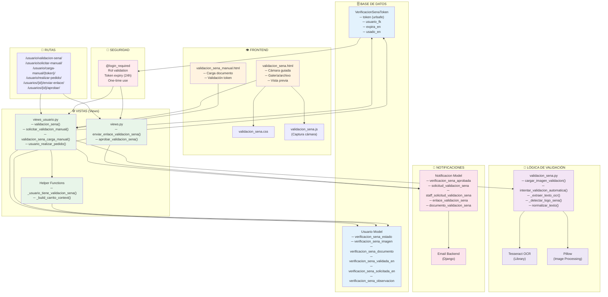
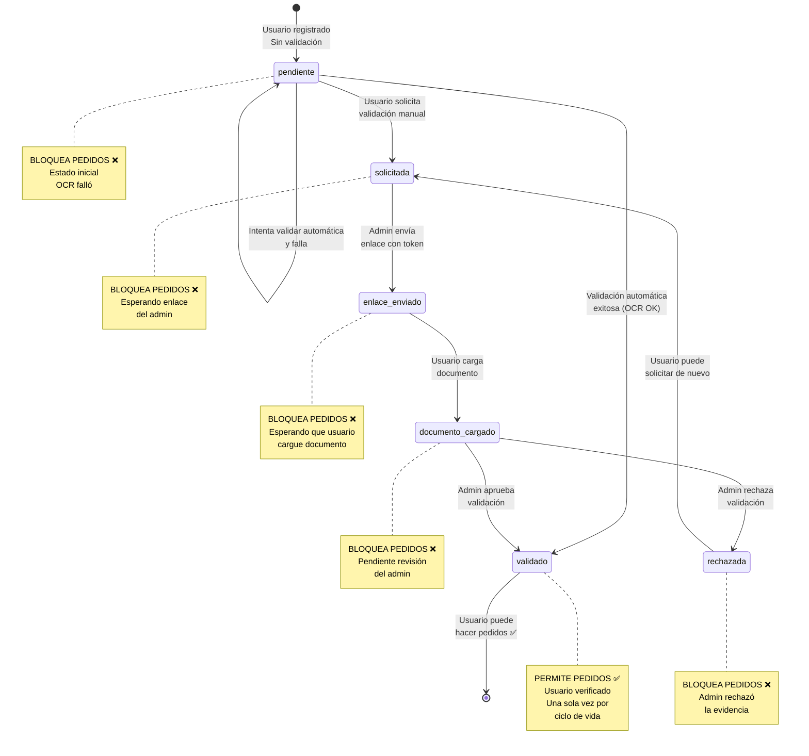

# Diagramas de Validación SENA

Este archivo contiene 3 diagramas Mermaid del sistema de validación SENA.

Puedes:
- Copiar el código y pegarlo en https://mermaid.live/ para exportar a PNG/SVG
- Usar la extensión Mermaid en VS Code para visualizar
- Incluirlo en documentación de GitHub

---

## 1. FLUJO COMPLETO DE VALIDACIÓN SENA

```mermaid
flowchart TD
    A["👤 Usuario Registrado<br/>(Estado: pendiente)"] --> B{¿Intenta hacer pedido?}
    
    B -->|SÍ| C["🔍 Sistema verifica<br/>verificacion_sena_estado"]
    B -->|NO| A
    
    C --> D{¿Estado<br/>== validado?}
    
    D -->|✓ SÍ| E["✅ Pedido autorizado<br/>Procede a crear pedido"]
    
    D -->|✗ NO| F["⚠️ BLOQUEO<br/>Redirige a validación"]
    
    F --> G["📱 Pantalla de Validación"]
    
    G --> H{¿Qué opción?}
    
    H -->|Cámara guiada| I["📸 Captura del carnet SENA"]
    H -->|Galería/archivo| J["📁 Selecciona foto existente"]
    
    I --> K["🧠 Validación Automática"]
    J --> K
    
    K --> L["1️⃣ OCR Tesseract<br/>Extrae texto del carnet"]
    L --> M["2️⃣ Detección de logo SENA<br/>Verifica área verde"]
    M --> N["3️⃣ Valida nombre<br/>Compara con cuenta"]
    N --> O["4️⃣ Valida documento<br/>Compara con CC"]
    
    O --> P{¿Todas<br/>validaciones<br/>OK?}
    
    P -->|✅ SÍ| Q["✅ ÉXITO<br/>Estado → validado<br/>Guarda imagen<br/>Timestamp: validada_en"]
    P -->|❌ NO| R["❌ FALLA<br/>Estado → pendiente<br/>Guarda razones"]
    
    Q --> S["🔔 Notificación de aprobación"]
    S --> T["🔄 Redirige al carrito"]
    T --> E
    
    R --> U["⚡ Muestra errores:<br/>- Logo no detectado<br/>- Nombre no coincide<br/>- Documento no coincide<br/>- OCR fallo"]
    
    U --> V{¿Usuario elige<br/>validación<br/>manual?}
    
    V -->|SÍ| W["📧 Solicita validación manual<br/>Estado → solicitada"]
    V -->|NO| G
    
    W --> X["👨‍💼 Admin recibe notificación"]
    X --> Y["🔗 Admin envía enlace<br/>con token (24h)<br/>Estado → enlace_enviado"]
    Y --> Z["📨 Usuario recibe email"]
    
    Z --> AA["🔐 Usuario abre enlace<br/>Pantalla de carga manual"]
    AA --> AB["📄 Sube carnet o<br/>certificado SENA<br/>Estado → documento_cargado"]
    
    AB --> AC["👨‍💼 Admin revisa documento"]
    AC --> AD{¿Documento<br/>válido?}
    
    AD -->|✅ SÍ| AE["✅ Admin aprueba<br/>Estado → validado<br/>Timestamp: validada_en"]
    AD -->|❌ NO| AF["❌ Admin rechaza<br/>Estado → rechazada"]
    
    AE --> AG["🔔 Notificación de aprobación"]
    AG --> AH["✅ Usuario puede hacer pedidos"]
    AH --> E
    
    AF --> AI["🔔 Notificación de rechazo"]
    AI --> A
    
    E --> AJ["✅ Pedido creado exitosamente"]
    
    style A fill:#e1f5e1
    style E fill:#c8e6c9
    style Q fill:#a5d6a7
    style AE fill:#a5d6a7
    style F fill:#ffcccc
    style R fill:#ffcccc
    style AF fill:#ffcccc
    style U fill:#fff3cd
    style V fill:#fff3cd
    style W fill:#fff3cd
```

---

## 2. ARQUITECTURA DE COMPONENTES

---

## 3. MÁQUINA DE ESTADOS

---

## Cómo usar estos diagramas

### En GitHub/GitLab
Copia el código Mermaid directamente en un `.md` - se renderiza automáticamente.

### En Notion, Confluencia, etc.
Usa https://mermaid.live/ → Pega el código → Exporta a PNG/SVG

### En PowerPoint/Presentaciones
1. Ve a https://mermaid.live/
2. Pega el código del diagrama
3. Click en "Download" → Selecciona PNG o SVG
4. Inserta la imagen en tu presentación

### En VS Code
Instala extensión **"Markdown Preview Mermaid Support"** y visualiza este archivo directamente.

---

**Creado:** 22 de abril de 2026
**Proyecto:** Sistema de Inventario SENA - Validación SENA
