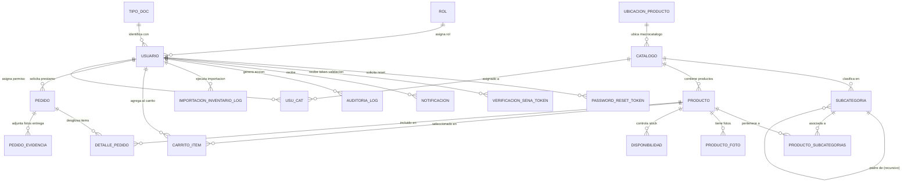

# Análisis Técnico y Diccionario de la Base de Datos: `invsena`

> **Sistema:** SGIT-CIDE-Sibaté (SENA CIDE — Sede La Colonia / Sibaté)  
> **Motor:** MariaDB 10.4 / MySQL (puerto local `3307`, remoto `3306`)  
> **Juego de caracteres:** `utf8mb4` con cotejamiento `utf8mb4_general_ci`  
> **Archivos SQL generados:**
> - [invsena_backup_actual.sql](file:///c:/xampp/htdocs/invt_sena/IA/documentacion/invsena_backup_actual.sql) (Estructura DDL + Datos completos actuales)
> - [invsena_estructura_solo_ddl.sql](file:///c:/xampp/htdocs/invt_sena/IA/documentacion/invsena_estructura_solo_ddl.sql) (Solo sentencias `CREATE TABLE` sin datos)
> - [senainventario.sql](file:///c:/xampp/htdocs/invt_sena/senainventario.sql) (Volcado raíz inicial)

---

## 📌 Tabla de Contenidos

1. [Resumen General](#1-resumen-general)
2. [Diagrama Entidad-Relación (ERD)](#2-diagrama-entidad-relación-erd)
3. [Diccionario de Datos por Módulos](#3-diccionario-de-datos-por-módulos)
   - [Módulo 1: Identidad, Roles y Autenticación](#módulo-1-identidad-roles-y-autenticación)
   - [Módulo 2: Catálogo y Clasificación Jerárquica](#módulo-2-catálogo-y-clasificación-jerárquica)
   - [Módulo 3: Productos, Multimedia y Existencias](#módulo-3-productos-multimedia-y-existencias)
   - [Módulo 4: Préstamos, Pedidos y Carrito](#módulo-4-préstamos-pedidos-y-carrito)
   - [Módulo 5: Auditoría, Historial y Notificaciones](#módulo-5-auditoría-historial-y-notificaciones)
4. [Relaciones de Negocio e Integridad Referencial](#4-relaciones-de-negocio-e-integridad-referencial)
5. [Análisis de Diseño y Oportunidades de Mejora](#5-análisis-de-diseño-y-oportunidades-de-mejora)

---

## 1. Resumen General

La base de datos contiene **30 tablas**, clasificadas en:

* **18 Tablas de Dominio y Negocio:** Gestión de inventario, préstamos con códigos OTP, subcategorías en árbol, validación SENA, auditoría y carrito.
* **12 Tablas de Sistema Django:** `auth_permission`, `auth_group`, `auth_group_permissions`, `django_content_type`, `django_migrations`, `django_session`, `django_admin_log`, `usuario_groups`, `usuario_user_permissions`.

---

## 2. Diagrama Entidad-Relación (ERD)

---

## 3. Diccionario de Datos por Módulos

### Módulo 1: Identidad, Roles y Autenticación

#### `rol`
Almacena los roles de autorización del sistema (`admin`, `almacenista`, `usuario`).
| Columna | Tipo | Nulo | Descripción / Regla |
| :--- | :--- | :--- | :--- |
| `id_rol` | `INT` PK | NO | Identificador único auto-incremental |
| `nombre_rol` | `VARCHAR(255)` | SÍ | Nombre del rol (`admin`, `almacenista`, `usuario`) |
| `fch_registro` | `DATETIME` | SÍ | Fecha de creación del rol |
| `fch_ult_act` | `DATETIME` | SÍ | Fecha de última modificación |

#### `tipo_doc`
Catálogo de documentos de identidad oficiales (C.C., T.I., C.E., etc.).
| Columna | Tipo | Nulo | Descripción / Regla |
| :--- | :--- | :--- | :--- |
| `id_tipo_doc` | `INT` PK | NO | Identificador único auto-incremental |
| `nombre` | `VARCHAR(60)` | NO | Nombre completo (ej. Cédula de Ciudadanía), UNIQUE |
| `codigo` | `VARCHAR(10)` | NO | Código corto (ej. `CC`, `TI`), UNIQUE |
| `fch_registro` | `DATETIME` | SÍ | Fecha de registro |
| `fch_ult_act` | `DATETIME` | SÍ | Fecha de última modificación |

#### `usuario`
Modelo de usuario extendido de Django (`AUTH_USER_MODEL`).
| Columna | Tipo | Nulo | Descripción / Regla |
| :--- | :--- | :--- | :--- |
| `id_usu` | `INT` PK | NO | Clave primaria |
| `correo` | `VARCHAR(255)` | NO | Identificador de acceso (`USERNAME_FIELD`), UNIQUE |
| `contrasena` | `VARCHAR(255)` | NO | Hash de contraseña (mapeado al atributo `password`) |
| `nombre` | `VARCHAR(255)` | SÍ | Nombre(s) de la persona |
| `apellido` | `VARCHAR(255)` | SÍ | Apellido(s) de la persona |
| `cc` | `VARCHAR(20)` | SÍ | Número de documento de identificación, UNIQUE |
| `id_tipo_doc_fk` | `INT` FK | SÍ | Referencia a `tipo_doc.id_tipo_doc` |
| `id_rol_fk` | `INT` FK | SÍ | Referencia a `rol.id_rol` |
| `telefono` | `VARCHAR(30)` | SÍ | Contacto telefónico |
| `fot_usu` | `VARCHAR(100)` | SÍ | Ruta de imagen de perfil |
| `banner_usu` | `VARCHAR(100)` | SÍ | Ruta de banner personalizado |
| `tema` | `VARCHAR(10)` | NO | Preferencia visual (`claro` / `oscuro`) |
| `programa_formacion` | `VARCHAR(255)` | SÍ | Ficha o programa de formación SENA |
| `centro_desarrollo` | `VARCHAR(255)` | SÍ | Centro SENA al que pertenece |
| `verificacion_sena_estado` | `VARCHAR(25)` | NO | `pendiente`, `solicitada`, `enlace_enviado`, `documento_cargado`, `validado`, `rechazada` |
| `verificacion_sena_imagen` | `VARCHAR(100)` | SÍ | Foto del carnet procesada por OCR |
| `verificacion_sena_documento`| `VARCHAR(100)`| SÍ | Soporte cargado en validación manual |
| `verificacion_sena_observacion`| `LONGTEXT` | SÍ | Motivos de rechazo o notas de auditoría |
| `verificacion_sena_solicitada_en`| `DATETIME(6)` | SÍ | Timestamp de solicitud manual |
| `verificacion_sena_validada_en` | `DATETIME(6)` | SÍ | Timestamp en que pasó a estado `validado` |
| `is_active` | `TINYINT(1)` | NO | Usuario activo (1) o deshabilitado (0) |
| `is_staff` | `TINYINT(1)` | NO | Acceso a interfaz de administración |
| `is_superuser` | `TINYINT(1)` | NO | Superadministrador con todos los permisos |
| `last_login` | `DATETIME(6)` | SÍ | Último inicio de sesión |

#### `password_reset_token`
Tokens efímeros de recuperación de clave vía correo electrónico.
| Columna | Tipo | Nulo | Descripción / Regla |
| :--- | :--- | :--- | :--- |
| `id_reset` | `INT` PK | NO | Clave primaria |
| `usuario_id` | `INT` FK | NO | Referencia a `usuario.id_usu` (`CASCADE`) |
| `token` | `VARCHAR(128)` | NO | Cadena aleatoria criptográfica, UNIQUE |
| `creado_en` | `DATETIME(6)` | NO | Fecha y hora de generación |
| `expira_en` | `DATETIME(6)` | NO | Fecha límite de validez (30 minutos) |
| `usado_en` | `DATETIME(6)` | SÍ | Fecha en que fue consumido el token |

#### `verificacion_sena_token`
Tokens de un solo uso para validación manual de carnets SENA.
| Columna | Tipo | Nulo | Descripción / Regla |
| :--- | :--- | :--- | :--- |
| `id_token` | `INT` PK | NO | Clave primaria |
| `usuario_id` | `INT` FK | NO | Referencia a `usuario.id_usu` (`CASCADE`) |
| `token` | `VARCHAR(128)` | NO | Token seguro para URL, UNIQUE |
| `creado_en` | `DATETIME(6)` | NO | Timestamp de creación |
| `expira_en` | `DATETIME(6)` | NO | Timestamp de caducidad (4 horas) |
| `usado_en` | `DATETIME(6)` | SÍ | Timestamp de consumo |

---

### Módulo 2: Catálogo y Clasificación Jerárquica

#### `ubicacion_producto`
Ubicaciones físicas dentro del almacén / bodegas (ej. "Estante A-1", "Taller Eléctrico").
| Columna | Tipo | Nulo | Descripción / Regla |
| :--- | :--- | :--- | :--- |
| `id_ubicacion` | `INT` PK | NO | Clave primaria |
| `nombre` | `VARCHAR(120)` | NO | Nombre de la ubicación física, UNIQUE |
| `fch_registro` | `DATETIME` | SÍ | Fecha de creación |
| `fch_ult_act` | `DATETIME` | SÍ | Fecha de modificación |

#### `catalogo`
Líneas de catálogo macro (ej. Herramientas Eléctricas, E.P.P., Mecánica).
| Columna | Tipo | Nulo | Descripción / Regla |
| :--- | :--- | :--- | :--- |
| `id_cat` | `INT` PK | NO | Clave primaria |
| `codigo_macro` | `VARCHAR(20)` | SÍ | Código macro clasificador (ej. `HERR`), UNIQUE |
| `nombre_catalogo` | `VARCHAR(255)` | SÍ | Nombre visible del catálogo |
| `descripcion` | `LONGTEXT` | SÍ | Detalle del alcance del catálogo |
| `id_ubicacion_fk` | `INT` FK | SÍ | Referencia a `ubicacion_producto.id_ubicacion` |
| `fch_registro` | `DATETIME` | SÍ | Fecha de creación |
| `fch_ult_act` | `DATETIME` | SÍ | Fecha de actualización |

#### `subcategoria`
Árbol jerárquico recursivo de clasificación de herramientas.
| Columna | Tipo | Nulo | Descripción / Regla |
| :--- | :--- | :--- | :--- |
| `id_subcat` | `INT` PK | NO | Clave primaria |
| `id_cat_fk` | `INT` FK | NO | Referencia al catálogo raíz (`catalogo.id_cat`) |
| `subcategoria_padre_id`| `INT` FK | SÍ | Autorreferencia a `subcategoria.id_subcat` (árbol) |
| `nombre_subcategoria` | `VARCHAR(255)` | NO | Nombre de la subcategoría |
| `codigo_clasificacion` | `VARCHAR(20)` | SÍ | Código numérico o alfanumérico del nivel |
| `descripcion` | `LONGTEXT` | SÍ | Descripción complementaria |
| `fch_registro` | `DATETIME` | SÍ | Fecha de registro |
| `fch_ult_act` | `DATETIME` | SÍ | Fecha de modificación |
> **Restricción UNIQUE:** `(id_cat_fk, subcategoria_padre_id, codigo_clasificacion)`

---

### Módulo 3: Productos, Multimedia y Existencias

#### `producto`
Herramientas, equipos, maquinaria e insumos gestionados en bodega.
| Columna | Tipo | Nulo | Descripción / Regla |
| :--- | :--- | :--- | :--- |
| `id_prod` | `INT` PK | NO | Clave primaria |
| `codigo_producto` | `VARCHAR(40)` | SÍ | Código institucional normalizado, UNIQUE |
| `nombre_producto` | `VARCHAR(255)` | SÍ | Nombre comercial o técnico |
| `descripcion` | `LONGTEXT` | SÍ | Ficha técnica y características |
| `fot_prod` | `VARCHAR(100)` | SÍ | Foto principal (convertida a `.webp`) |
| `unidad_medida` | `VARCHAR(20)` | NO | `unidad`, `metro`, `rollo`, `caja`, `par`, `set`, `kg`, `litro` |
| `ubicacion` | `VARCHAR(255)` | NO | Ubicación descriptiva específica |
| `tipo_bien` | `VARCHAR(20)` | NO | `devolutivo` (requiere retorno) o `consumo` (gastable) |
| `numero_placa` | `VARCHAR(80)` | SÍ | Placa de inventario físico SENA |
| `cuentadante` | `VARCHAR(255)` | SÍ | Funcionario/instructor a cargo del bien |
| `id_cat_fk` | `INT` FK | NO | Referencia a `catalogo.id_cat` |
| `fch_registro` | `DATETIME` | SÍ | Fecha de ingreso a inventario |
| `fch_ult_act` | `DATETIME` | SÍ | Fecha de última actualización |

#### `producto_subcategorias`
Tabla intermedia Many-to-Many entre `producto` y `subcategoria`.
| Columna | Tipo | Nulo | Descripción / Regla |
| :--- | :--- | :--- | :--- |
| `id` | `BIGINT` PK | NO | Clave primaria |
| `producto_id` | `INT` FK | NO | Referencia a `producto.id_prod` |
| `subcategoria_id` | `INT` FK | NO | Referencia a `subcategoria.id_subcat` |

#### `producto_foto`
Galería multimedia adicional por producto.
| Columna | Tipo | Nulo | Descripción / Regla |
| :--- | :--- | :--- | :--- |
| `id_foto` | `INT` PK | NO | Clave primaria |
| `id_prod_fk` | `INT` FK | NO | Referencia a `producto.id_prod` (`CASCADE`) |
| `foto` | `VARCHAR(100)` | NO | Archivo de imagen optimizado a WebP |
| `orden` | `SMALLINT UNSIGNED`| NO | Prioridad de visualización en la galería |
| `fch_registro` | `DATETIME(6)` | NO | Fecha de subida |

#### `disponibilidad`
Existencias numéricas y control de inventario disponible.
| Columna | Tipo | Nulo | Descripción / Regla |
| :--- | :--- | :--- | :--- |
| `id_disp` | `INT` PK | NO | Clave primaria |
| `id_prod_fk` | `INT` FK | NO | Referencia a `producto.id_prod` (`CASCADE`) |
| `cantidad` | `INT` | SÍ | Existencia total registrada |
| `stock` | `INT` | SÍ | Unidades libres para préstamo inmediato |
| `descr_dispo` | `LONGTEXT` | SÍ | Novedades o estado físico de las existencias |
| `fch_registro` | `DATETIME` | SÍ | Timestamp de registro |
| `fch_ult_act` | `DATETIME` | SÍ | Timestamp de actualización |

---

### Módulo 4: Préstamos, Pedidos y Carrito

#### `carrito_item`
Almacén en BD de productos seleccionados por el usuario antes de ordenar.
| Columna | Tipo | Nulo | Descripción / Regla |
| :--- | :--- | :--- | :--- |
| `id_carrito_item` | `INT` PK | NO | Clave primaria |
| `id_usuario_fk` | `INT` FK | NO | Referencia a `usuario.id_usu` (`CASCADE`) |
| `id_prod_fk` | `INT` FK | NO | Referencia a `producto.id_prod` (`CASCADE`) |
| `cantidad` | `INT UNSIGNED` | NO | Unidades solicitadas (mínimo 1) |
| `fch_registro` | `DATETIME` | SÍ | Fecha de agregado al carrito |
| `fch_ult_act` | `DATETIME` | SÍ | Fecha de cambio de cantidad |
> **Restricción UNIQUE:** `(id_usuario_fk, id_prod_fk)`

#### `pedido`
Cabecera de la solicitud de préstamo o insumos.
| Columna | Tipo | Nulo | Descripción / Regla |
| :--- | :--- | :--- | :--- |
| `id_pedido` | `INT` PK | NO | Clave primaria |
| `id_usuario_fk` | `INT` FK | NO | Solicitante (`usuario.id_usu`) |
| `estado` | `VARCHAR(50)` | NO | `pendiente`, `esperando entrega`, `entregado`, `devuelto`, `vencido`, `cancelado`, `rechazado` |
| `total_productos` | `INT UNSIGNED` | NO | Número de líneas de producto distintas |
| `total_unidades` | `INT UNSIGNED` | NO | Sumatoria total de unidades físicas |
| `codigo_entrega` | `VARCHAR(6)` | SÍ | PIN OTP de 6 dígitos para despacho seguro |
| `codigo_expira_en` | `DATETIME(6)` | SÍ | Caducidad del PIN de entrega o devolución |
| `area_ubicacion` | `LONGTEXT` | SÍ | Taller, ambiente o aula donde se usarán los bienes |
| `motivo_rechazo` | `LONGTEXT` | SÍ | Justificación en caso de rechazo por almacén |
| `foto_carnet` | `VARCHAR(100)` | SÍ | Imagen del carnet aportada en el pedido |
| `tipo_devolucion` | `VARCHAR(10)` | SÍ | `global` o `parcial` |
| `fecha_devolucion` | `DATETIME(6)` | SÍ | Fecha máxima acordada para la devolución |
| `notif_vencimiento_enviada`| `TINYINT(1)`| NO | Bandera para evitar reenvío de alertas |
| `extensiones_plazo` | `SMALLINT UNSIGNED`| NO | Contador de prórrogas aplicadas (máximo 3) |
| `fch_registro` | `DATETIME` | SÍ | Fecha de creación del pedido |
| `fch_ult_act` | `DATETIME` | SÍ | Fecha de último cambio de estado |

#### `detalle_pedido`
Líneas de producto individuales dentro de un préstamo.
| Columna | Tipo | Nulo | Descripción / Regla |
| :--- | :--- | :--- | :--- |
| `id_det_pedido` | `INT` PK | NO | Clave primaria |
| `id_pedido_fk` | `INT` FK | NO | Referencia a `pedido.id_pedido` (`CASCADE`) |
| `id_prod_fk` | `INT` FK | SÍ | Referencia a `producto.id_prod` (`SET NULL`) |
| `nombre_producto` | `VARCHAR(255)` | NO | Snapshot histórico del nombre del bien |
| `nombre_catalogo` | `VARCHAR(255)` | SÍ | Snapshot histórico de la línea |
| `cantidad_solicitada`| `INT UNSIGNED` | NO | Cantidad pedida |
| `stock_referencia` | `INT` | SÍ | Stock que existía al momento de solicitar |
| `estado_detalle` | `VARCHAR(50)` | NO | Estado particular de la línea |
| `fecha_devolucion` | `DATETIME(6)` | SÍ | Fecha de devolución específica del ítem |
| `fch_registro` | `DATETIME` | SÍ | Fecha de registro |
| `fch_ult_act` | `DATETIME` | SÍ | Fecha de actualización |

#### `pedido_evidencia`
Registro fotográfico como comprobante de entrega en almacén.
| Columna | Tipo | Nulo | Descripción / Regla |
| :--- | :--- | :--- | :--- |
| `id_evidencia` | `INT` PK | NO | Clave primaria |
| `id_pedido_fk` | `INT` FK | NO | Referencia a `pedido.id_pedido` (`CASCADE`) |
| `foto_evidencia` | `VARCHAR(100)` | NO | Imagen de soporte |
| `fch_registro` | `DATETIME` | SÍ | Timestamp de captura |

---

### Módulo 5: Auditoría, Historial y Notificaciones

#### `auditoria_log`
Bitácora de seguridad y trazabilidad operacional.
| Columna | Tipo | Nulo | Descripción / Regla |
| :--- | :--- | :--- | :--- |
| `id_log` | `INT` PK | NO | Clave primaria |
| `accion` | `VARCHAR(30)` | NO | `crear`, `actualizar`, `eliminar`, etc. |
| `entidad` | `VARCHAR(80)` | NO | `producto`, `pedido`, `usuario`, `subcategoria`, etc. |
| `entidad_id` | `VARCHAR(80)` | SÍ | ID del registro afectado |
| `descripcion` | `LONGTEXT` | NO | Detalle textual de lo ocurrido y actores |
| `rol_usuario` | `VARCHAR(80)` | SÍ | Rol del autor al momento de ejecutar la acción |
| `ip_origen` | `VARCHAR(45)` | SÍ | Dirección IPv4 o IPv6 del cliente |
| `id_usuario_fk` | `INT` FK | SÍ | Referencia a `usuario.id_usu` (`SET NULL`) |
| `fch_registro` | `DATETIME(6)` | NO | Timestamp exacto del suceso |

#### `importacion_inventario_log`
Historial de cargas masivas de inventario vía hojas de cálculo Excel.
| Columna | Tipo | Nulo | Descripción / Regla |
| :--- | :--- | :--- | :--- |
| `id_log_import` | `INT` PK | NO | Clave primaria |
| `id_usuario_fk` | `INT` FK | SÍ | Usuario que subió el archivo |
| `nombre_archivo`| `VARCHAR(255)` | NO | Nombre del archivo Excel procesado |
| `estado` | `VARCHAR(20)` | NO | `ok`, `error`, `parcial` |
| `total_productos` | `INT UNSIGNED` | NO | Registros evaluados |
| `total_creados` | `INT UNSIGNED` | NO | Nuevos productos insertados |
| `total_actualizados`| `INT UNSIGNED`| NO | Productos existentes refrescados |
| `total_imagenes_principales`| `INT UNSIGNED`| NO | Fotos principales procesadas |
| `total_imagenes_secundarias`| `INT UNSIGNED`| NO | Fotos secundarias cargadas |
| `total_errores` | `INT UNSIGNED` | NO | Filas con inconsistencias |
| `resumen` | `LONGTEXT` | SÍ | Registro de fallos y detalles de importación |
| `fch_registro` | `DATETIME(6)` | NO | Fecha de ejecución de la importación |

#### `notificacion`
Bandeja de avisos del sistema para usuarios y personal administrativo.
| Columna | Tipo | Nulo | Descripción / Regla |
| :--- | :--- | :--- | :--- |
| `id_noti` | `INT` PK | NO | Clave primaria |
| `id_usuario_fk` | `INT` FK | NO | Destinatario (`usuario.id_usu`) |
| `tipo` | `VARCHAR(40)` | NO | Tipo de alerta (ej. `pedido_creado`, `prestamo_vencido`, `staff_nuevo_pedido`) |
| `titulo` | `VARCHAR(120)` | NO | Encabezado del mensaje |
| `mensaje` | `LONGTEXT` | NO | Cuerpo descriptivo de la notificación |
| `leida` | `TINYINT(1)` | NO | 0 = no leída, 1 = leída |
| `id_pedido_ref` | `INT UNSIGNED` | SÍ | ID del pedido asociado para navegación directa |
| `fch_registro` | `DATETIME(6)` | NO | Fecha y hora de generación |

---

## 4. Relaciones de Negocio e Integridad Referencial

1. **Eliminación en Cascada Controlada:**
   * Si se elimina un `Pedido`, sus `DetallePedido` y `PedidoEvidencia` se eliminan en cascada (`ON DELETE CASCADE`), garantizando que no queden líneas huérfanas.
   * Si se elimina un `Producto`, las líneas de pedidos históricos conservan su registro: `detalle_pedido.id_prod_fk` pasa a `SET NULL` y la información textual (`nombre_producto`, `nombre_catalogo`) se preserva como snapshot histórico.
2. **Historial de Auditoría Inmutable:**
   * Las referencias en `auditoria_log.id_usuario_fk` utilizan `ON DELETE SET NULL`, de manera que si un usuario o aprendiz es eliminado del sistema, la bitácora histórica de eventos pasados permanece intacta para fines de control fiscal e institucional.
3. **Jerarquía sin Ciclos:**
   * La tabla `subcategoria` admite niveles ilimitados en BD, pero a nivel de modelo Django (`Subcategoria.save`) existe una validación recursiva con conjunto de nodos visitados que aborta la operación si se detecta un bucle o una profundidad superior a 30 niveles.

---

## 5. Análisis de Diseño y Oportunidades de Mejora

| Aspecto Analizado | Estado Actual | Recomendación Técnica |
| :--- | :--- | :--- |
| **Snapshots en `detalle_pedido`** | Guarda `nombre_producto` y `nombre_catalogo` redundantes. | **Excelente decisión de diseño**: evita que si en el futuro se renombra un producto en inventario, se alteren las actas o registros de préstamos de años anteriores. |
| **Tipos de Bienes** | Campo `tipo_bien` (`devolutivo` vs `consumo`). | Crucial para la bodega del SENA: permite discriminar qué ítems descuentan inventario físico permanente y cuáles deben ser fiscalizados al término de la formación. |
| **Indexación en `auditoria_log`** | Tiene índice por `id_usuario_fk` y PK. | Se recomienda añadir un índice compuesto en `(entidad, fch_registro)` para optimizar las consultas del panel de auditoría cuando la tabla supere 100.000 filas. |
| **Compatibilidad con Django 6** | `contrasena` mapeado a `password`. | Se mantiene sincronizado mediante `db_column='contrasena'` en `models.Usuario`, garantizando compatibilidad total con el algoritmo Argon2/PBKDF2 de Django. |
